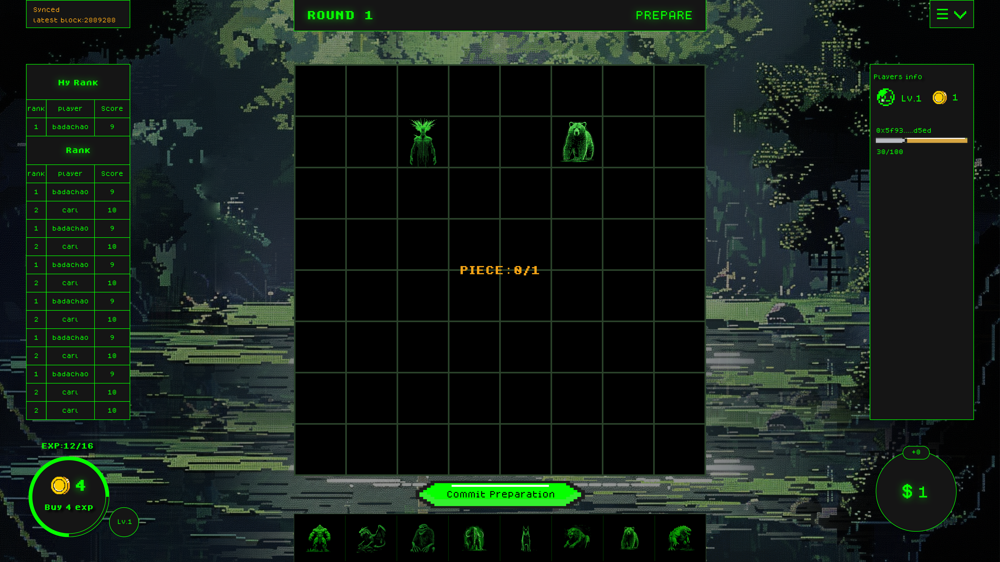

# Zenith

Zenith loot suvivior beast based auto chess game built with dojo. This project is funded by Frontinius House & BilbiothecaDAO. See <https://frontinus.house/proposal/30> for detail.




# Get started

Require:

1. Linux/MacOS/WSL
2. [dojo](https://book.dojoengine.org/) = 0.6.0
3. [node](https://nodejs.org/) >=18
4. [pnpm](https://pnpm.io/)
5. [jq](https://github.com/jqlang/jq)


Install dependencies

```bash
pnpm install
```


start local preview 

```bash
pnpm dev
```
